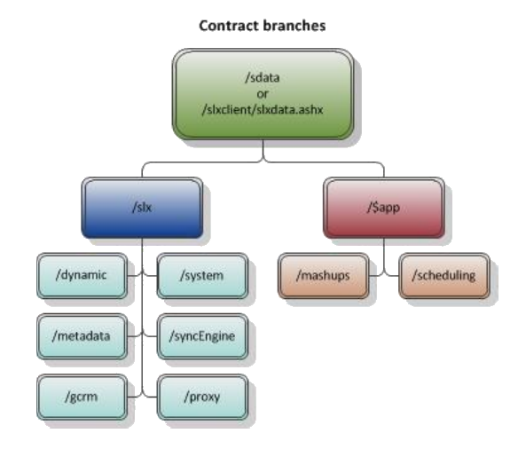

# Saleslogix SData Endpoints Whitepaper #

[< Back]({{ page.back }}.html) | [Home](index.html) | [Next >]({{ page.next }}.html)

---

## {{ page.title }} ##

Sage Data (SData) is the communication protocol that serves as a common language for
interaction between Sage products worldwide. Sage products use SData to generate and
consume feeds of information, similar to RSS feeds. For example Financial Accounting/ERP
applications can provide feeds containing sales orders, customer details, or project details.
SData also allows Sage software to interact with the many third-party systems and services
available through Web 2.0 technology.

- SData is a standards-based (HTTP, Atom) specification.
- SData describes the mechanisms designed to support scenarios such as application
integration, mobile clients, or mashups.

### SData Endpoints ###
SData uses Uniform Resource Identifiers (URIs), a compact string of characters used to identify
or name a resource, to communicate with web services. These web services then query, insert,
update, or delete information based on the URI sent.

- Supports GET, POST, PUT, and DELETE in both the Atom and JSON/BSON formats.
All values are editable.
- Supports the standard payload control options such as filtering, paging, and sorting.

There are several endpoint contracts currently being offered through SData:

- Dynamic
- System
- Metadata
- SyncEngine
- GCRM
- Proxy
- Mashups
- Scheduling

Under the virtual directory, sdata, there are two application branches, slx and $app. The adapters,
or contracts, are divided between the two application branches as shown in the Contact branches
diagram. The slx branch contains contracts that are specific to Sage SalesLogix while the $app
branch contains platform application contracts.

### Consuming SData Feeds ###
All SData feeds are exposed through both the SData portal and the Sage SalesLogix Web client
slxdata.ashx handler. The slxdata.ashx handler allows direct access to feeds through the Web
Client portal. When customizations are written this way, the Web Client portal handles
authentication. The following queries access the same feeds:

    http://localhost/sdata/slx/dynamic/-/accounts
    http://localhost/slxclient/slxdata.ashx/slx/dynamic/-/accounts

### Training ###
Sage offers training through the Sage Master's Series. For more information or to register for
the SData Master's Course, contact Sage University at 888-765-6662 or online at
[www.sageu.com](http://www.sageu.com).

---

[< Back]({{ page.back }}.html) | [Home](index.html) | [Next >]({{ page.next }}.html)